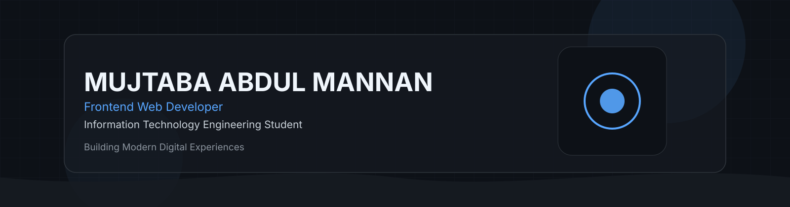

<!-- ====================================================================== -->
<!--                                                                         -->
<!--                MUJTABA ABDUL MANNAN • GITHUB PROFILE                    -->
<!--                                                                         -->
<!-- ====================================================================== -->

<p align="center">



</p>

<br>

<h1 align="center">

Mujtaba Abdul Mannan

</h1>

<p align="center">

<strong>Frontend Web Developer</strong>

<br>

Information Technology Engineering Student

</p>

<p align="center">

Building modern, responsive and user-focused digital experiences through
clean code, elegant interfaces and continuous learning.

</p>

<br>

<p align="center">

<a href="https://www.linkedin.com/in/mujtabaabdulmannan">


</a>

<a href="https://github.com/mujtabaabdulmannan">


</a>

<a href="mailto:mrmujtabaabdulmannan@gmail.com">


</a>

<a href="#">


</a>

</p>

---

# Engineering Profile

> *"I enjoy transforming ideas into modern, responsive and meaningful digital experiences through thoughtful design and frontend engineering."*

I'm **Mujtaba Abdul Mannan**, a **Second-Year Information Technology Engineering Student** based in **Hyderabad, India**.

My primary focus is frontend web development, where I enjoy building modern interfaces that combine usability, performance and clean visual design.

I believe good software is more than writing code—it is about understanding user problems, designing intuitive experiences and continuously improving through practice.

Currently I'm investing my time in strengthening JavaScript fundamentals, building production-quality frontend projects and preparing for future software engineering internships.

---

# Quick Overview

<table>

<tr>

<td width="50%">

### 👨‍💻 Profile

```text
Role

Frontend Web Developer

Education

Information Technology Engineering

Current Year

Second Year

Location

Hyderabad, India

Career Goal

Software Engineer
```

</td>

<td width="50%">

### 🎯 Current Focus

```text
✓ Modern Frontend Development

✓ Responsive Design

✓ JavaScript

✓ UI Design

✓ Performance

✓ Accessibility

✓ Real Projects

✓ Continuous Learning
```

</td>

</tr>

</table>

---

# Professional Highlights

<table>

<tr>

<td align="center" width="25%">

### 💻

Frontend

Modern responsive websites

</td>

<td align="center" width="25%">

### 🎨

UI Design

Clean interfaces

</td>

<td align="center" width="25%">

### 🚀

Projects

Real-world portfolio

</td>

<td align="center" width="25%">

### 📚

Learning

Always improving

</td>

</tr>

</table>

---

# Featured Work

<table>

<tr>

<td width="50%">

## 🌟 LUMAAN Perfumes

Luxury perfume website inspired by premium Arabian and French fragrance brands.

### Highlights

- Premium User Interface
- Responsive Design
- Luxury Branding
- Elegant Shopping Experience
- Modern Product Showcase

### Technology

HTML5

CSS3

JavaScript

<br>

<a href="https://lumaanperfumes.in">


</a>

</td>

<td width="50%">

## 💎 Pearl Beauty Parlour

Professional salon website designed with a modern appointment-focused user experience.

### Highlights

- Responsive Layout
- Elegant Business Design
- Customer-focused Experience
- Professional Branding
- Mobile Friendly

### Technology

HTML5

CSS3

JavaScript

<br>

<a href="https://pearlbeautyparlour.netlify.app">


</a>

</td>

</tr>

</table>

---
<!-- ========================================================= -->
<!--                 ENGINEERING DASHBOARD                     -->
<!-- ========================================================= -->

# Engineering Dashboard

<table>

<tr>

<td width="33%">

### 🎓 Education

```yaml
Degree:
  B.E. Information Technology

Status:
  Second Year Student

Institution:
  Engineering Program

Objective:
  Build strong software engineering
  fundamentals through practical
  project-based learning.
```

</td>

<td width="33%">

### 🚀 Current Focus

```yaml
Primary:
  Frontend Development

Improving:
  JavaScript

Practicing:
  Responsive UI

Exploring:
  Accessibility

Building:
  Real World Projects
```

</td>

<td width="33%">

### 🎯 Career Vision

```yaml
Goal:
  Software Engineer

Interests:
  Frontend Engineering

Learning:
  Modern Web Development

Future:
  Open Source
  Freelancing
  Internship
```

</td>

</tr>

</table>

---

# Engineering Metrics

<table>

<tr>

<td width="50%">

## Frontend Development

█████████░ 90%

Building responsive and modern web interfaces using HTML, CSS and JavaScript.

</td>

<td width="50%">

## Responsive Design

██████████ 95%

Designing layouts that adapt across desktop, tablet and mobile devices.

</td>

</tr>

<tr>

<td width="50%">

## JavaScript

███████░░░ 70%

Strengthening fundamentals through practical frontend projects.

</td>

<td width="50%">

## UI Design

█████████░ 90%

Creating clean, intuitive and visually balanced user interfaces.

</td>

</tr>

<tr>

<td width="50%">

## Git

███████░░░ 70%

Version control and collaborative workflow.

</td>

<td width="50%">

## GitHub

███████░░░ 70%

Repository management and project documentation.

</td>

</tr>

</table>

---

# Current Learning Journey

<table>

<tr>

<td>

✅ Advanced JavaScript

</td>

<td>

🟡 Accessibility (WCAG)

</td>

<td>

🟡 Performance Optimization

</td>

</tr>

<tr>

<td>

🟡 Git Workflow

</td>

<td>

🟡 Frontend Architecture

</td>

<td>

🟡 Engineering Best Practices

</td>

</tr>

</table>

---

# Engineering Principles

<table>

<tr>

<td>

💡 Build with Purpose

Every project should solve a real problem and provide value to users.

</td>

<td>

🧹 Keep It Clean

Readable, maintainable and scalable code is always the priority.

</td>

</tr>

<tr>

<td>

📈 Continuous Learning

Technology evolves every day, and consistent learning is part of engineering.

</td>

<td>

🎨 User First

Great software combines functionality, performance and thoughtful design.

</td>

</tr>

</table>

---

# Development Workflow

```text
 Research
     │
     ▼
 Planning
     │
     ▼
 UI / UX Design
     │
     ▼
 Frontend Development
     │
     ▼
 Testing
     │
     ▼
 Optimization
     │
     ▼
 Deployment
     │
     ▼
 Continuous Improvement
```

---
<!-- ========================================================= -->
<!--                     TECH STACK                            -->
<!-- ========================================================= -->

# Technology Stack

<p align="center">


</p>

<table>

<tr>

<td width="50%">

## Frontend

```text
HTML5

Semantic Structure

Responsive Layouts

Modern Components

Accessibility

Performance-Oriented Design
```

</td>

<td width="50%">

## Styling

```text
CSS3

Responsive Design

Flexbox

Grid

Animations

Modern UI
```

</td>

</tr>

<tr>

<td width="50%">

## Programming

```text
JavaScript

DOM Manipulation

ES6 Fundamentals

Interactive UI

Frontend Logic
```

</td>

<td width="50%">

## Tools

```text
Git

GitHub

VS Code

Adobe Photoshop

Canva
```

</td>

</tr>

</table>

---

# Currently Learning

<table>

<tr>

<td>

🟢 Advanced JavaScript

</td>

<td>

🟢 Responsive UI Architecture

</td>

<td>

🟢 Accessibility (WCAG)

</td>

</tr>

<tr>

<td>

🟢 Git Workflow

</td>

<td>

🟢 Performance Optimization

</td>

<td>

🟢 Frontend Best Practices

</td>

</tr>

</table>

---

# GitHub Analytics

<p align="center">


</p>

<p align="center">


</p>

<p align="center">


</p>

---

# 2026 Engineering Goals

<table>

<tr>

<td width="33%">

### Learning

- Master JavaScript
- Learn React
- Improve Git Workflow
- Study Frontend Architecture

</td>

<td width="33%">

### Projects

- Build 15+ Quality Projects
- Enhance Portfolio
- Improve UI Design
- Create Reusable Components

</td>

<td width="33%">

### Career

- Secure Software Internship
- Gain Freelance Experience
- Contribute to Open Source
- Continue Continuous Learning

</td>

</tr>

</table>

---

# Engineering Philosophy

> **"Great software is built with curiosity, refined through iteration, and measured by the experience it creates for users."**

I believe every project is an opportunity to improve—not only as a developer, but also as a problem solver. My focus is on writing clean, maintainable frontend code while creating responsive and user-friendly digital experiences.

---

# Let's Connect

<p align="center">

<a href="https://www.linkedin.com/in/mujtabaabdulmannan">


</a>

<a href="https://github.com/mujtabaabdulmannan">


</a>

<a href="mailto:mrmujtabaabdulmannan@gmail.com">


</a>

<a href="https://lumaanperfumes.in">


</a>

</p>

---

<p align="center">



</p>

<p align="center">

<sub>
Designed & Developed by <strong>Mujtaba Abdul Mannan</strong><br>
Building modern digital experiences through continuous learning and thoughtful engineering.
</sub>

</p>
<!-- =============================================================== -->
<!--                      FEATURED PROJECTS                          -->
<!-- =============================================================== -->

<br>

<h1 align="center">

Featured Engineering Projects

</h1>

<p align="center">

Projects focused on creating modern, responsive and user-centered web experiences.

</p>

---

<table>

<tr>

<td width="50%">

<h2 align="center">

🌟 LUMAAN Perfumes

</h2>

<p align="center">

<b>Luxury Perfume E-Commerce Experience</b>

</p>

<p>

A premium perfume website inspired by Arabian and French fragrance brands, designed with an emphasis on luxury branding, responsive layouts and an immersive shopping experience.

</p>

### Key Features

✔ Premium Luxury UI

✔ Responsive Design

✔ Smooth Animations

✔ Shopping Experience

✔ Product Showcase

✔ Mobile Optimized

✔ Modern Navigation

✔ Elegant Branding

---

### Technology

<p>


</p>

---

### Live Project

<a href="https://lumaanperfumes.in">


</a>

<br><br>

<a href="https://github.com/mujtabaabdulmannan">


</a>

---

### Future Improvements

• User Authentication

• Product Search

• Wishlist

• Order Tracking

• Payment Gateway

• Admin Dashboard

</td>

<td width="50%">

<p align="center">


</p>

</td>

</tr>

</table>

<br>

---

<br>

<table>

<tr>

<td width="50%">

<p align="center">


</p>

</td>

<td width="50%">

<h2 align="center">

💎 Pearl Beauty Parlour

</h2>

<p align="center">

<b>Professional Beauty Salon Website</b>

</p>

<p>

A modern business website designed to establish an elegant online presence for a beauty salon while providing a clean appointment-focused user experience.

</p>

### Key Features

✔ Elegant Interface

✔ Appointment Focused

✔ Responsive Layout

✔ Professional Branding

✔ Mobile Friendly

✔ Service Showcase

✔ Business Information

✔ Contact Experience

---

### Technology

<p>


</p>

---

### Live Project

<a href="https://pearlbeautyparlour.netlify.app">


</a>

<br><br>

<a href="https://github.com/mujtabaabdulmannan">


</a>

---

### Future Improvements

• Online Booking

• Gallery Management

• Customer Reviews

• Admin Dashboard

• Online Consultation

</td>

</tr>

</table>

---

# Engineering Highlights

<table>

<tr>

<td align="center">

## 🌍

Projects Built

### 5+

Real-world websites

</td>

<td align="center">

## 💻

Frontend

Modern UI

Responsive Design

</td>

<td align="center">

## 🎨

Design

Luxury Interfaces

Clean UX

</td>

<td align="center">

## 📈

Goal

Continuous Improvement

Real Experience

</td>

</tr>

</table>

---
<!-- ========================================================= -->
<!--                 ENGINEERING EXCELLENCE                    -->
<!-- ========================================================= -->

<br>

<h1 align="center">

Engineering Excellence

</h1>

<p align="center">

My approach to learning software engineering focuses on building practical projects,
writing maintainable code, and continuously improving through hands-on experience.

</p>

---

<table>

<tr>

<td width="33%">

<h3 align="center">💻</h3>

<h3 align="center">Build</h3>

<p align="center">

Create modern websites with
clean architecture,
responsive layouts
and polished interfaces.

</p>

</td>

<td width="33%">

<h3 align="center">📚</h3>

<h3 align="center">Learn</h3>

<p align="center">

Continuously strengthen
JavaScript,
frontend engineering,
Git workflow,
and accessibility.

</p>

</td>

<td width="33%">

<h3 align="center">🚀</h3>

<h3 align="center">Improve</h3>

<p align="center">

Every project is an
opportunity to improve
design thinking,
problem solving
and development practices.

</p>

</td>

</tr>

</table>

---

# Engineering Roadmap

<table>

<tr>

<td width="25%">

## 🌱 Stage 1

Frontend Foundations

✅ HTML

✅ CSS

✅ JavaScript

✅ Responsive Design

</td>

<td width="25%">

## ⚙ Stage 2

Current Focus

JavaScript

Performance

Accessibility

Git Workflow

</td>

<td width="25%">

## 🚀 Stage 3

Next Goals

React

REST APIs

Modern Frontend

Reusable Components

</td>

<td width="25%">

## 🎯 Stage 4

Career

Internship

Freelancing

Open Source

Software Engineer

</td>

</tr>

</table>

---

# Development Process

```text

Research
   │
   ▼

Planning
   │
   ▼

Wireframing
   │
   ▼

UI Design
   │
   ▼

Frontend Development
   │
   ▼

Responsive Testing
   │
   ▼

Performance Optimization
   │
   ▼

Deployment
   │
   ▼

Continuous Improvement

```

---

# Core Values

<table>

<tr>

<td>

### 🧠 Problem Solving

I enjoy breaking down complex ideas into simple, user-friendly solutions.

</td>

<td>

### 🎨 User Experience

Every interface should be intuitive, accessible and visually balanced.

</td>

</tr>

<tr>

<td>

### ⚡ Performance

Fast-loading, responsive websites create better user experiences.

</td>

<td>

### 📈 Growth Mindset

Learning never stops. Every project teaches something new.

</td>

</tr>

</table>

---

# 2026 Professional Goals

- ✅ Master Advanced JavaScript
- ✅ Learn React
- ✅ Build 15+ quality frontend projects
- ✅ Secure a software engineering internship
- ✅ Gain freelance development experience
- ✅ Contribute to open-source projects
- ✅ Strengthen frontend architecture knowledge

---

# Beyond Code

<table>

<tr>

<td width="50%">

### What motivates me

- Building real-world projects
- Solving practical problems
- Improving UI/UX quality
- Learning modern engineering practices
- Creating meaningful digital experiences

</td>

<td width="50%">

### Interests

- Frontend Engineering
- User Interface Design
- Web Performance
- Product Design
- Software Development
- Open Source

</td>

</tr>

</table>

---

# Connect With Me

<p align="center">

<a href="https://www.linkedin.com/in/mujtabaabdulmannan">

</a>

<a href="https://github.com/mujtabaabdulmannan">

</a>

<a href="mailto:mrmujtabaabdulmannan@gmail.com">

</a>

<a href="https://lumaanperfumes.in">

</a>

<a href="https://pearlbeautyparlour.netlify.app">

</a>

</p>

---

<p align="center">

<i>
"Building better digital experiences, one project at a time."
</i>

</p>

<p align="center">


</p>

<p align="center">

<sub>

Designed & Developed by <strong>Mujtaba Abdul Mannan</strong>

<br>

Frontend Web Developer • Information Technology Engineering Student

</sub>

</p>
