<!-- 
  ============================================================================
  MUJTABA ABDUL MANNAN • PREMIUM GITHUB PROFILE
  Frontend Web Developer | Information Technology Engineering Student
  ============================================================================
  NOTE: This README uses advanced GitHub-compatible HTML, inline styling, 
  and dynamic SVG widgets to simulate a high-end CSS/JS portfolio experience.
  ============================================================================
-->

  <!-- ASSET: Create an animated SVG with CSS keyframes inside this file -->
  

  <!-- DYNAMIC JS TYPING EFFECT (Backend rendered as SVG) -->
  

 

<!-- ============================================================================
  SECTION 1: PROFESSIONAL INTRODUCTION (Apple/Stripe Style)
  ============================================================================ -->

  <h1 style="font-size: 32px; font-weight: 700; color: #F0F6FC; margin-bottom: 8px;">Mujtaba Abdul Mannan</h1>
  

    Second-Year Information Technology Engineering Student based in Hyderabad, India. 
    I engineer modern, responsive, and user-centric digital experiences through clean code, 
    thoughtful design, and relentless attention to detail.
  

  
  

    
    
    
  

<!-- ============================================================================
  SECTION 2: ENGINEERING DASHBOARD
  ============================================================================ -->

  <!-- ASSET: A sleek dashboard SVG showing your stats visually -->
  

<!-- ============================================================================
  SECTION 3: ABOUT ME (High-End Typography & Layout)
  ============================================================================ -->

<table style="width: 100%; border-collapse: separate; border-spacing: 0 16px;">
  <tr>
    <td width="65%" style="background-color: #161B22; border: 1px solid #30363D; border-radius: 12px; padding: 24px; vertical-align: top;">
      <h3 style="color: #58A6FF; margin-top: 0; font-size: 20px;">👨‍💻 About Me</h3>
      

        I am a <strong style="color: #F0F6FC;">Second-Year Information Technology Engineering Student</strong> with a deep focus on <strong style="color: #58A6FF;">Frontend Web Development</strong>. 
      

      

        My engineering philosophy is simple: great software is not just about writing code. It is about understanding user problems, architecting intuitive experiences, and writing maintainable, scalable code. I believe in learning by building, which is why I dedicate my time to production-quality projects that solve real-world problems.
      

      

        <strong style="color: #3FB950;">Current Focus:</strong> Mastering advanced JavaScript patterns, optimizing web performance, enforcing WCAG accessibility standards, and preparing for impactful software engineering internships.
      

    </td>
    <td width="35%" style="vertical-align: top; padding-left: 16px;">
      
        
      
    </td>
  </tr>
</table>

<!-- ============================================================================
  SECTION 4: ENGINEERING METRICS (Inline CSS Cards)
  ============================================================================ -->

 
<h3 style="color: #F0F6FC; border-bottom: 1px solid #30363D; padding-bottom: 8px;">📊 Engineering Metrics</h3>

<table style="width: 100%; border-collapse: separate; border-spacing: 12px 0;">
  <tr>
    <td width="25%" align="center" style="background: linear-gradient(145deg, #161B22, #0D1117); border: 1px solid #30363D; border-radius: 12px; padding: 20px;">
      <h4 style="color: #58A6FF; margin: 0 0 8px 0;">Frontend Dev</h4>
      
Modern UI & Architecture

      
    </td>
    <td width="25%" align="center" style="background: linear-gradient(145deg, #161B22, #0D1117); border: 1px solid #30363D; border-radius: 12px; padding: 20px;">
      <h4 style="color: #3FB950; margin: 0 0 8px 0;">Responsive Design</h4>
      
Mobile-First Layouts

      
    </td>
    <td width="25%" align="center" style="background: linear-gradient(145deg, #161B22, #0D1117); border: 1px solid #30363D; border-radius: 12px; padding: 20px;">
      <h4 style="color: #D29922; margin: 0 0 8px 0;">JavaScript</h4>
      
ES6+ & DOM Manipulation

      
    </td>
    <td width="25%" align="center" style="background: linear-gradient(145deg, #161B22, #0D1117); border: 1px solid #30363D; border-radius: 12px; padding: 20px;">
      <h4 style="color: #79C0FF; margin: 0 0 8px 0;">UI/UX Design</h4>
      
Clean & Intuitive Interfaces

      
    </td>
  </tr>
</table>

<!-- ============================================================================
  SECTION 5: FEATURED PROJECTS (Premium Card Layout)
  ============================================================================ -->

 
<h3 style="color: #F0F6FC; border-bottom: 1px solid #30363D; padding-bottom: 8px;">🚀 Featured Projects</h3>

  

<!-- PROJECT 1 -->

  

    🌟 LUMAAN Perfumes | Luxury E-Commerce Experience
    ▼ Click to Expand
  

  

  <table style="width: 100%;">
    <tr>
      <td width="60%" style="vertical-align: top; padding-right: 20px;">
        
A premium, responsive website inspired by Arabian and French fragrance brands, engineered with an emphasis on luxury branding, smooth animations, and an immersive shopping experience.

        <h4 style="color: #8B949E; font-size: 14px; margin-bottom: 8px;">✨ Key Features</h4>
        <ul style="color: #F0F6FC; font-size: 14px; line-height: 1.8; margin-top: 0;">
          <li>Premium Luxury UI Design & Elegant Branding</li>
          <li>Fully Responsive, Mobile-First Layout</li>
          <li>Smooth CSS Animations & Transitions</li>
          <li>Modern Product Showcase Architecture</li>
        </ul>
        <h4 style="color: #8B949E; font-size: 14px; margin-bottom: 8px;">🛠 Technology</h4>
        

          
          
          
        

        <h4 style="color: #8B949E; font-size: 14px; margin-bottom: 8px;">🔮 Future Roadmap</h4>
        <ul style="color: #8B949E; font-size: 13px; line-height: 1.6; margin-top: 0;">
          <li>User Authentication & Order Tracking</li>
          <li>Advanced Product Search & Wishlist</li>
          <li>Payment Gateway Integration</li>
        </ul>
         
        
        
      </td>
      <td width="40%" align="center" style="vertical-align: top;">
        <!-- ASSET: High-quality screenshot -->
        
      </td>
    </tr>
  </table>

<!-- PROJECT 2 -->

  

    💎 Pearl Beauty Parlour | Professional Business Website
    ▼ Click to Expand
  

  

  <table style="width: 100%;">
    <tr>
      <td width="40%" align="center" style="vertical-align: top;">
        <!-- ASSET: High-quality screenshot -->
        
      </td>
      <td width="60%" style="vertical-align: top; padding-left: 20px;">
        
A modern, appointment-focused business website designed to establish an elegant online presence for a beauty salon while providing a clean, customer-focused user experience.

        <h4 style="color: #8B949E; font-size: 14px; margin-bottom: 8px;">✨ Key Features</h4>
        <ul style="color: #F0F6FC; font-size: 14px; line-height: 1.8; margin-top: 0;">
          <li>Elegant Business Interface & Professional Branding</li>
          <li>Appointment-Focused User Journey</li>
          <li>Mobile-First Responsive Layout</li>
          <li>Comprehensive Service Showcase</li>
        </ul>
        <h4 style="color: #8B949E; font-size: 14px; margin-bottom: 8px;">🛠 Technology</h4>
        

          
          
          
        

        <h4 style="color: #8B949E; font-size: 14px; margin-bottom: 8px;">🔮 Future Roadmap</h4>
        <ul style="color: #8B949E; font-size: 13px; line-height: 1.6; margin-top: 0;">
          <li>Online Booking System & Admin Dashboard</li>
          <li>Gallery Management & Customer Reviews</li>
          <li>Online Consultation Feature</li>
        </ul>
         
        
        
      </td>
    </tr>
  </table>

<!-- ============================================================================
  SECTION 6: TECHNOLOGY STACK
  ============================================================================ -->

 
<h3 style="color: #F0F6FC; border-bottom: 1px solid #30363D; padding-bottom: 8px;">🛠️ Technology Stack</h3>

  

  
  
  
  
  
  
  

<!-- ============================================================================
  SECTION 7: LEARNING TIMELINE & WORKFLOW
  ============================================================================ -->

 
<table style="width: 100%; border-collapse: separate; border-spacing: 0 16px;">
  <tr>
    <td width="50%" style="background-color: #161B22; border: 1px solid #30363D; border-radius: 12px; padding: 24px; vertical-align: top;">
      <h3 style="color: #58A6FF; margin-top: 0;">📈 Learning Timeline</h3>
      
      <ul style="color: #F0F6FC; font-size: 14px; line-height: 1.8;">
        <li>✔ <strong>Stage 1:</strong> HTML5, CSS3, JS Fundamentals, Git</li>
        <li>◐ <strong>Stage 2:</strong> Advanced JS, WCAG Accessibility, Performance</li>
        <li>○ <strong>Stage 3:</strong> React.js, REST APIs, Software Internship</li>
      </ul>
    </td>
    <td width="50%" style="background-color: #161B22; border: 1px solid #30363D; border-radius: 12px; padding: 24px; vertical-align: top;">
      <h3 style="color: #58A6FF; margin-top: 0;">🔄 Development Workflow</h3>
      
      

        Research → Planning → Wireframing → UI Design → Frontend Development → Responsive Testing → Performance Optimization → Deployment → Continuous Improvement
      

    </td>
  </tr>
</table>

<!-- ============================================================================
  SECTION 8: ENGINEERING PHILOSOPHY
  ============================================================================ -->

 

  

<table style="width: 100%; border-collapse: separate; border-spacing: 12px 0;">
  <tr>
    <td width="50%" style="background-color: #161B22; border: 1px solid #30363D; border-radius: 12px; padding: 20px;">
      <h4 style="color: #F0F6FC; margin-top: 0;">🧠 Problem Solving</h4>
      
Breaking down complex ideas into simple, user-friendly solutions that provide real value.

    </td>
    <td width="50%" style="background-color: #161B22; border: 1px solid #30363D; border-radius: 12px; padding: 20px;">
      <h4 style="color: #F0F6FC; margin-top: 0;">🎨 User First</h4>
      
Every interface must be intuitive, accessible, and visually balanced for the best experience.

    </td>
  </tr>
  <tr>
    <td width="50%" style="background-color: #161B22; border: 1px solid #30363D; border-radius: 12px; padding: 20px;">
      <h4 style="color: #F0F6FC; margin-top: 0;">⚡ Performance</h4>
      
Fast-loading, responsive websites create better user experiences and higher engagement.

    </td>
    <td width="50%" style="background-color: #161B22; border: 1px solid #30363D; border-radius: 12px; padding: 20px;">
      <h4 style="color: #F0F6FC; margin-top: 0;">📈 Growth Mindset</h4>
      
Learning never stops. Every project is an opportunity to refine my engineering practices.

    </td>
  </tr>
</table>

<!-- ============================================================================
  SECTION 9: GITHUB ANALYTICS
  ============================================================================ -->

 
<h3 style="color: #F0F6FC; border-bottom: 1px solid #30363D; padding-bottom: 8px;">📊 GitHub Analytics</h3>

  

  

  

<!-- ============================================================================
  SECTION 10: 2026 ROADMAP & ACHIEVEMENTS
  ============================================================================ -->

 
<table style="width: 100%; border-collapse: separate; border-spacing: 0 16px;">
  <tr>
    <td width="50%" style="background-color: #161B22; border: 1px solid #30363D; border-radius: 12px; padding: 24px;">
      <h3 style="color: #58A6FF; margin-top: 0;">🏆 Current Milestones</h3>
      <ul style="color: #F0F6FC; font-size: 15px; line-height: 2;">
        <li>✔ Built and deployed <strong>5+ real-world</strong> responsive websites</li>
        <li>✔ Mastered core <strong>HTML, CSS, and JavaScript</strong> fundamentals</li>
        <li>✔ Developed <strong>2 production-quality</strong> live projects (LUMAAN & Pearl)</li>
        <li>✔ Actively learning <strong>Advanced JS & Accessibility</strong> standards</li>
      </ul>
    </td>
    <td width="50%" style="background-color: #161B22; border: 1px solid #30363D; border-radius: 12px; padding: 24px;">
      <h3 style="color: #3FB950; margin-top: 0;">🎯 2026 Professional Roadmap</h3>
      <ul style="color: #F0F6FC; font-size: 15px; line-height: 2;">
        <li>🚀 Master <strong>React.js</strong> and modern frontend architecture</li>
        <li>🚀 Build <strong>15+ quality projects</strong> with reusable components</li>
        <li>🚀 Secure a <strong>Software Engineering Internship</strong></li>
        <li>🚀 Gain <strong>freelance experience</strong> and contribute to Open Source</li>
      </ul>
    </td>
  </tr>
</table>

<!-- ============================================================================
  SECTION 11: PROFESSIONAL CONTACT
  ============================================================================ -->

 

  <h2 style="color: #F0F6FC; margin-top: 0; font-size: 28px;">Let's Build Something Great</h2>
  

    I'm always open to discussing new projects, frontend engineering opportunities, freelance work, or creative ideas.
  

  
  

    
    
    
  

<!-- ============================================================================
  SECTION 12: FOOTER
  ============================================================================ -->

 

  

  
    Designed & Engineered by <strong style="color: #F0F6FC;">Mujtaba Abdul Mannan</strong> 
    <em>"Building better digital experiences, one project at a time."</em> 
    Frontend Web Developer • Information Technology Engineering Student • Hyderabad, India
  

  

